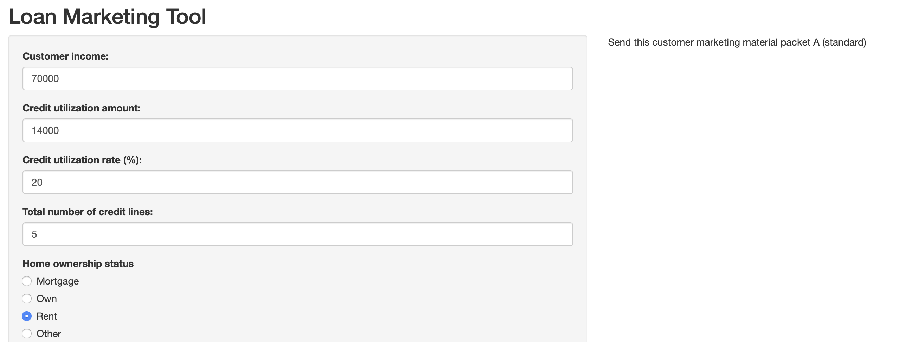

+++
author = "Eric Voss"
title = "Loan Marketing Segmentation"
description = "End-to-end project to build and deploy marketing model from Lending Club data"
date = "2020-11-15"
unlisted = "true"
+++

[Shiny app](https://ericvoss.shinyapps.io/debtconsolidationapp/)

[GitHub repo](https://github.com/envoss11/LendingClubProject)

[R Markdown report with code/visualizations](LCClean.html)

Using publicly available data from crowd-sourced lending platform Lending Club, I set out to create a classifier which would help solve a marketing problem which (I imagine) a company like this would encounter. I realized that one of the most popular loan types Lending Club provided, debt conslidation, was rather different than the rest from a marketing perspective. An advertisement for a debt consolidation product would likely relate to the stress caused by having too many sources of debt, and then offer to help them simplify that situation. This is the exact opposite of the message one would want to send to persuade a customer to take on a new loan for something like a car or home improvements. 

I chose to focus my analysis on predicting whether a client would be more likely interested in debt consolidation products or other, more conventional loans. The final deliverable for this project was a Shiny app in which a marketing employee could input information about a prospective customer, and receive a response telling them which marketing materials to send them - the standard materials, or something focused on debt consolidation products. I tried out a variety of different models, including a classification tree and bagging and boosting method, finally settling on a model trained with xgboost which maximized the accuracy of my model.

 

The model did not produce mind-blowing results, but it is a clear improvement over just guessing which category a customer might fall into. Playing around with the Shiny app yields mostly sensible results - for example, under the default parameters with a customer having 20 credit lines and 50% credit utilization, the model suggests debt consolidation. Change that number of credit lines to 5 and credit utilization rate to 20%, and the model no longer suggests debt consolidation marketing.

 